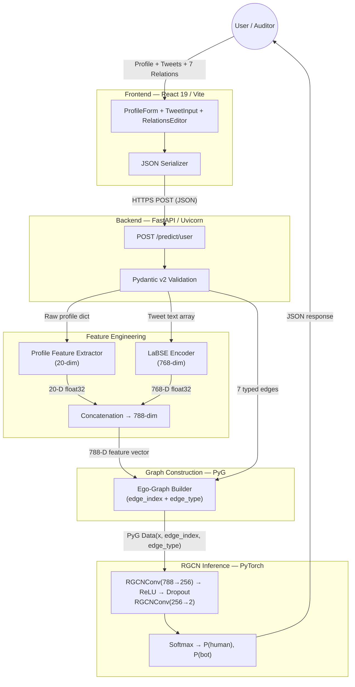

<div align="center">

# 🛡️ MGTAB Bot Detector

### Multi-Relational Graph-Based Twitter/X Account Detection

**Classify any Twitter/X account as Bot or Human using a Relational Graph Convolutional Network trained on 10,199 expert-annotated accounts across 7 relationship types.**

[](https://python.org)
[](https://pytorch.org)
[](https://pyg.org)
[](https://react.dev)
[](https://vitejs.dev)
[](https://fastapi.tiangolo.com)
[](https://huggingface.co/sentence-transformers/LaBSE)
[](https://github.com/GraphDetec/MGTAB)
[](https://hub.docker.com)
[](LICENSE)

---

[**Features**](#-features) · [**Architecture**](#-architecture--system-design) · [**Quick Start**](#-quick-start) · [**Live Demo**](#-live-demo--screenshots) · [**MGTAB Compliance**](#-mgtab-paper-compliance) · [**Citation**](#-citation)

</div>

---

## 📌 Project Overview

Social media bot detection is no longer a metadata-classification problem — it's a **graph topology** problem. Modern bots forge realistic profiles and mimic human language, but they cannot easily replicate the complex multi-relational interaction patterns of genuine users across follow, mention, reply, quote, hashtag, and URL networks.

**MGTAB Bot Detector** is a full-stack web application that implements the detection methodology described in the [MGTAB benchmark paper](https://arxiv.org/abs/2301.01123v2) (Shi et al., 2023). It combines:

- **20 high-information-gain profile features** (selected via Information Gain analysis)
- **768-dimensional tweet embeddings** from [LaBSE](https://huggingface.co/sentence-transformers/LaBSE) (Language-agnostic BERT Sentence Embedding)
- **7 multi-relational graph edges** (5 explicit directed + 2 implicit undirected)
- A **2-layer RGCN** (Relational Graph Convolutional Network) trained on 10,199 expert-annotated Twitter accounts

The system achieves **88.23% test accuracy** and **90.29% bot recall**, outperforming GCN, GAT, and GraphSAGE baselines on the same dataset.

### Why RGCN over standard GNNs?

Standard GCN/GAT/GraphSAGE treat all edges uniformly. RGCN maintains **separate learned weight matrices per relation type**, enabling the model to learn that a "reply" interaction carries fundamentally different signal than a "follower" link for bot detection. This heterogeneous edge modeling is the key architectural advantage.

---

## ✨ Features

| | Feature | Description |
|---|---|---|
| 🧠 | **RGCN Inference Engine** | 2-layer Relational GCN (`788→256→2`) with 7 relation-specific weight matrices |
| 📊 | **788-Dimensional Feature Vectors** | 20 profile features + 768 LaBSE tweet embeddings per node |
| 🔗 | **7 Multi-Relational Edges** | Follower, Friend, Mention, Reply, Quoted, URL co-occurrence, Hashtag co-occurrence |
| 🌐 | **React 19 Frontend** | Glassmorphism dark UI with animated components, demo data, analytics dashboard |
| ⚡ | **FastAPI Backend** | Async inference API with Pydantic v2 validation and OpenAPI docs |
| 📐 | **Paper-Exact Normalization** | log(1+x) + MinMax scaling with bounds from the official MGTAB repository |
| 🐳 | **Docker + HF Spaces** | Production Dockerfile with CPU-optimized PyTorch for free-tier cloud deployment |
| 🧪 | **End-to-End Tests** | Bot vs. Human profile test suite with pre-built request payloads |
| 📈 | **Analytics Dashboard** | Model comparison (GCN/GAT/GraphSAGE/RGCN), feature importance, dataset stats |
| 🔄 | **Demo Data Presets** | One-click human/bot profile, tweet, and relation demos for instant testing |

---

## 🖼️ Live Demo & Screenshots

> **Frontend (Vercel):** Deployed as a static SPA on Vercel's edge CDN  
> **Backend (Hugging Face Spaces):** Containerized FastAPI on `arihant0008-mgtab-detector-api.hf.space`
---


## 🏗️ Architecture & System Design

### High-Level System Architecture



### Data Flow Pipeline

```
┌─────────────┐     ┌──────────────┐     ┌──────────────────────┐     ┌──────────┐     ┌────────┐
│ Twitter/X   │────▶│ React UI     │────▶│ FastAPI Backend      │────▶│ RGCN     │────▶│ Result │
│ Account     │     │ (3 sections) │     │ (Feature + Graph)    │     │ Forward  │     │ JSON   │
│ Data        │     │              │     │                      │     │ Pass     │     │        │
└─────────────┘     └──────────────┘     └──────────────────────┘     └──────────┘     └────────┘
                          │                        │
                    ┌─────┴─────┐            ┌─────┴─────────────────────┐
                    │           │            │                           │
              Profile Data  Tweets    Feature Engineering         Graph Builder
              (20 fields)  (N texts)        │                           │
                                     ┌──────┴──────┐            ┌──────┴──────┐
                                     │             │            │             │
                                  20 profile   768 LaBSE    edge_index   edge_type
                                  features     embedding    (COO tensor) (relation IDs)
                                     │             │            │             │
                                     └──────┬──────┘            └──────┬──────┘
                                            │                         │
                                      788-D vector              PyG Data object
                                      (per node)               (mini ego-graph)
```

---

### Feature Engineering (788 Dimensions)

The feature vector for each node is a concatenation of **20 profile features** and a **768-dimensional LaBSE tweet embedding**, matching the exact layout of the MGTAB `features.pt` tensor.

#### Profile Features (Indices 0–19)

| Index | Feature Name | Type | Normalization |
|-------|-------------|------|---------------|
| 0 | `profile_use_background_image` | Boolean | 0.0 / 1.0 |
| 1 | `default_profile` | Boolean | 0.0 / 1.0 |
| 2 | `verified` | Boolean | 0.0 / 1.0 |
| 3 | `followers_count` | Numerical | log(1+x) → MinMax |
| 4 | `default_profile_image` | Boolean | 0.0 / 1.0 |
| 5 | `listed_count` | Numerical | log(1+x) → MinMax |
| 6 | `statuses_count` | Numerical | log(1+x) → MinMax |
| 7 | `friends_count` | Numerical | log(1+x) → MinMax |
| 8 | `geo_enabled` | Boolean | 0.0 / 1.0 |
| 9 | `favourites_count` | Numerical | log(1+x) → MinMax |
| 10 | `created_at` | Temporal | log(ts×10⁹) → MinMax |
| 11 | `screen_name_length` | Derived | MinMax [3, 15] |
| 12 | `name_length` | Derived | MinMax [1, 50] |
| 13 | `description_length` | Derived | MinMax [0, 204] |
| 14 | `followers_friends_ratio` | Derived | log(1+x) → MinMax |
| 15 | `default_profile_background_color` | Boolean | 0.0 / 1.0 |
| 16 | `default_profile_sidebar_fill_color` | Boolean | 0.0 / 1.0 |
| 17 | `default_profile_sidebar_border_color` | Boolean | 0.0 / 1.0 |
| 18 | `has_url` | Boolean | 0.0 / 1.0 |
| 19 | `profile_background_image_url` | Boolean | 0.0 / 1.0 |

#### Tweet Embedding (Indices 20–787)

Tweets are encoded using **LaBSE** (`sentence-transformers/LaBSE`):

1. Each tweet is tokenized (max 128 tokens) and passed through BERT
2. `[CLS]` pooler output is extracted (768-dim per tweet)
3. L2-normalized per tweet
4. Averaged across all tweets → single 768-dim vector

```python
# Pseudocode from app/features.py
embeddings = labse_model(tokenized_tweets).pooler_output   # [N, 768]
embeddings = F.normalize(embeddings, p=2, dim=1)            # L2 norm
avg_embedding = embeddings.mean(dim=0)                      # [768]
```

#### MinMax Bounds (from MGTAB Official Repository)

```python
FEATURE_BOUNDS = {
    "followers_count":          {"min": 0.0,       "max": 25.572674},
    "friends_count":            {"min": 0.0,       "max": 21.029877},
    "listed_count":             {"min": 0.0,       "max": 17.675406},
    "created_at":               {"min": 36.553529, "max": 51.711108},
    "favourites_count":         {"min": 0.0,       "max": 19.711042},
    "statuses_count":           {"min": 0.0,       "max": 20.386231},
    "screen_name_length":       {"min": 3.0,       "max": 15.0},
    "name_length":              {"min": 1.0,       "max": 50.0},
    "description_length":       {"min": 0.0,       "max": 204.0},
    "followers_friends_ratios": {"min": 0.0,       "max": 11.169299},
}
```

---

### Multi-Relational Graph (7 Edge Types)

Edges encode the social topology around the target account. The 7 relation types follow **Table 4** of the MGTAB paper:

| ID | Relation | Category | Direction | Description |
|----|----------|----------|-----------|-------------|
| 0 | **Follower** | Explicit | B → A | User B follows user A (target) |
| 1 | **Friend** | Explicit | A → B | User A (target) follows user B |
| 2 | **Mention** | Explicit | A → B | User A mentions user B in tweets |
| 3 | **Reply** | Explicit | A → B | User A replies to user B's tweet |
| 4 | **Quoted** | Explicit | A → B | User A quotes user B's tweet |
| 5 | **URL** | Implicit | A ↔ B | Users share the same URLs (undirected) |
| 6 | **Hashtag** | Implicit | A ↔ B | Users share the same hashtags (undirected) |

**Key implementation decisions:**

- **Undirected relations** (URL, Hashtag) are implemented by inserting **bidirectional edges** in the COO tensor
- **Neighbors without real profile/tweet data** are automatically filtered out — injecting zero-vector neighbors would corrupt RGCN's mean aggregation
- When no valid edges exist, a **self-loop** (type 0) is added so the model operates in feature-only mode via its root weight parameter

---

### RGCN Model Architecture

```
Input: x ∈ ℝ^(N×788), edge_index ∈ ℤ^(2×E), edge_type ∈ ℤ^E

Layer 1:  RGCNConv(788 → 256, num_relations=7)
          → ReLU activation
          → Dropout(p=0.5)

Layer 2:  RGCNConv(256 → 2, num_relations=7)

Output:   Softmax → [P(human), P(bot)]
```

The RGCN message-passing update rule at layer _l_ for target node _v₀_:

$$h_0^{(l+1)} = \sigma \left( \sum_{r \in \mathcal{R}} \sum_{j \in \mathcal{N}_r(0)} \frac{1}{c_{0,r}} W_r^{(l)} h_j^{(l)} + W_0^{(l)} h_0^{(l)} \right)$$

Where:
- **W_r** — learned weight matrix specific to relation type _r_ (7 separate matrices per layer)
- **W_0** — self-loop weight preserving the node's own features
- **c_{0,r}** — normalization constant for relation _r_
- **σ** — ReLU activation function

#### Training Details

| Parameter | Value |
|-----------|-------|
| Optimizer | Adam (lr=0.001) |
| Epochs | 200 |
| Dropout | 0.5 |
| Loss | CrossEntropyLoss (class-weighted: ~2.7× for bot class) |
| Train/Val/Test Split | 80% / 10% / 10% (random permutation) |
| Best Model Selection | Highest validation accuracy |

---

## 🛠️ Tech Stack

| Layer | Technology | Purpose |
|-------|-----------|---------|
| **Frontend** | React 19, Vite 8, React Router 7 | SPA with glassmorphism UI |
| **Styling** | Vanilla CSS (custom design system) | Inter font, CSS variables, animations |
| **Backend** | FastAPI 0.115, Uvicorn 0.30.0 | Async HTTP API with OpenAPI docs |
| **Validation** | Pydantic v2.9 | Request/response schema enforcement |
| **ML Framework** | PyTorch 2.2 (CPU) | Tensor operations and model inference |
| **GNN Library** | PyTorch Geometric 2.4+ | RGCNConv layers, Data objects |
| **NLP Encoder** | Transformers 4.44 (LaBSE) | 768-dim multilingual tweet embeddings |
| **Containerization** | Docker (python:3.11-slim) | Reproducible production builds |
| **Frontend Hosting** | Vercel | Global CDN edge deployment |
| **Backend Hosting** | Hugging Face Spaces | Dockerized GPU-free inference |

---

## 📄 MGTAB Paper Compliance

This implementation strictly adheres to the methodology described in:

> **MGTAB: A Multi-Relational Graph-Based Twitter Account Detection Benchmark**  
> Shi et al., 2023 — arXiv:2301.01123v2

| Paper Specification | This Implementation |
|--------------------|--------------------|
| 20 profile features selected by IG | ✅ Exact same 20 features in exact index order (`features.py`) |
| LaBSE tweet embeddings | ✅ `sentence-transformers/LaBSE` with CLS pooling and L2 norm |
| 788-dim feature vectors (20+768) | ✅ Concatenated in `build_node_feature()` |
| 7 relation types (Table 4) | ✅ All 7 with correct directionality (`config.py`) |
| 5 explicit directed + 2 implicit undirected | ✅ Follower reversal + URL/Hashtag bidirectional edges |
| RGCN with relation-specific weights | ✅ `RGCNConv` from PyG with `num_relations=7` |
| 2-layer RGCN (hidden=256) | ✅ `RGCNConv(788→256→2)` with ReLU + Dropout(0.5) |
| MinMax normalization bounds | ✅ Bounds extracted from [official repo](https://github.com/GraphDetec/MGTAB) |
| log(1+x) for count features | ✅ Applied before MinMax in `normalization.py` |
| Class imbalance handling | ✅ Weighted CrossEntropy (weight_bot ≈ 2.7) during training |
| 10,199 labeled accounts | ✅ Full benchmark dataset in `Dataset/` directory |

---

## 🚀 Quick Start

### Prerequisites

- **Python 3.11+**
- **Node.js 18+** and npm
- ~2GB disk space (LaBSE model downloaded on first run)

### 1. Clone the Repository

```bash
git clone https://github.com/Arihant0008/MGTAB.git
cd MGTAB
```

### 2. Backend Setup

```bash
cd backend

# Create and activate virtual environment
python -m venv venv
# Windows:
venv\Scripts\activate
# macOS/Linux:
# source venv/bin/activate

# Install PyTorch CPU
pip install torch==2.2.0+cpu --index-url https://download.pytorch.org/whl/cpu

# Install remaining dependencies
pip install "numpy<2.0.0" torch-geometric>=2.4.0 transformers==4.44.0
pip install -r requirements.txt
```

### 3. Start the Backend

```bash
uvicorn app.main:app --host 0.0.0.0 --port 8000 --reload
```

> ⚠️ **First request** will download the LaBSE model (~1.8GB). Subsequent requests are fast.

Verify the backend is running:

```bash
curl http://localhost:8000/health
# {"status":"healthy","model_loaded":true}
```

### 4. Frontend Setup

```bash
cd ../frontend

npm install
```

Before starting, update the API base URL for local development:

```javascript
// frontend/src/api/predict.js — uncomment local URL:
const API_BASE = 'http://localhost:8000';
// const API_BASE = 'https://arihant0008-mgtab-detector-api.hf.space';
```

```bash
npm run dev
```

Open **http://localhost:5173** in your browser.

### 5. Test the API

```bash
cd ../backend
python test_api.py
```

Expected output:

```
==================================================
  Bot-like Profile
==================================================
  Prediction: BOT
  Confidence: XX.X%
  P(human):   XX.X%
  P(bot):     XX.X%
  Graph:      1 nodes, 1 edges

==================================================
  Human-like Profile
==================================================
  Prediction: HUMAN
  Confidence: XX.X%
  ...
```

---

## 🐳 Docker Deployment

The backend ships with a production-ready Dockerfile optimized for free-tier cloud hosting:

```bash
cd backend
docker build -t mgtab-api .
docker run -p 7860:7860 mgtab-api
```

**Key Dockerfile optimizations:**
- CPU-only PyTorch (`torch==2.2.0+cpu`) — reduces image from ~3GB to ~1.5GB
- Layered `pip install` for Docker cache efficiency
- Pre-flight `import` validation before deploying
- Non-root user for Hugging Face Spaces security requirements

---

## 📁 Project Structure

```
MGTAB/
├── backend/                          # Python FastAPI inference server
│   ├── app/
│   │   ├── __init__.py
│   │   ├── main.py                   # FastAPI app, endpoints, Pydantic models
│   │   ├── config.py                 # Paths, model dims, relation map, CORS
│   │   ├── features.py              # 20 profile features + LaBSE 768-dim encoder
│   │   ├── normalization.py         # log(1+x), MinMax bounds from MGTAB repo
│   │   ├── graph_builder.py         # PyG ego-graph construction with edge filtering
│   │   ├── rgcn_model.py            # 2-layer RGCN definition (PyG RGCNConv)
│   │   └── inference.py             # Model loading + predict() pipeline
│   ├── Dockerfile                    # Production container (python:3.11-slim + CPU PyTorch)
│   ├── requirements.txt              # FastAPI, Uvicorn, Pydantic
│   ├── test_api.py                   # End-to-end bot vs. human API tests
│   └── test_model_load.py           # Model checkpoint loading validation
│
├── frontend/                         # React 19 SPA (Vite)
│   ├── src/
│   │   ├── App.jsx                   # Router: Home, Detector, Analytics
│   │   ├── main.jsx                  # React DOM entry point
│   │   ├── index.css                 # Design system (CSS variables, glassmorphism)
│   │   ├── api/
│   │   │   └── predict.js            # API client (predictUser, getHealth, etc.)
│   │   ├── components/
│   │   │   ├── Hero.jsx / Hero.css           # Animated landing hero
│   │   │   ├── ModelStats.jsx / .css         # Pipeline steps + model comparison
│   │   │   ├── Navbar.jsx                    # Fixed navigation bar
│   │   │   ├── ProfileForm.jsx               # 20-field profile input + demo presets
│   │   │   ├── TweetInput.jsx                # Dynamic tweet list with LaBSE hint
│   │   │   ├── RelationsEditor.jsx           # 7 relation types (explicit + implicit)
│   │   │   └── ResultCard.jsx / .css         # Prediction display with prob bars
│   │   └── pages/
│   │       ├── HomePage.jsx                  # Hero + ModelStats
│   │       ├── DetectorPage.jsx / .css       # Main detection interface
│   │       └── AnalyticsPage.jsx / .css      # Dataset stats + model benchmarks
│   ├── index.html                    # SEO meta tags, dark background
│   ├── package.json                  # React 19, React Router 7, Vite 8
│   └── vite.config.js
│
├── Datasets and precrosessing/       # Training pipeline & benchmark data
│   ├── Dataset/                      # MGTAB tensors
│   │   ├── features.pt               # [10199, 788] feature matrix
│   │   ├── edge_index.pt             # [2, E] COO edge tensor
│   │   ├── edge_type.pt              # [E] relation IDs (0–6)
│   │   ├── edge_weight.pt            # [E] PMI weights for implicit edges
│   │   ├── labels_bot.pt             # [10199] binary labels (0=human, 1=bot)
│   │   └── labels_stance.pt          # [10199] stance labels (optional task)
│   ├── 1. Step - Check Shape/        # Verify tensor dimensions
│   ├── 2. Step - check null/         # Validate no NaN/null in features
│   ├── 3. Step - check labels/       # Label distribution verification
│   ├── 4. Step - construct graph/    # Build PyG Data from raw tensors
│   ├── 5. Step - test_train_split/   # 80/10/10 random split with masks
│   ├── 6. Step - Models/             # Training scripts (GCN, GAT, GraphSAGE, RGCN)
│   ├── 7. Step - models_saved/       # Saved model checkpoints
│   ├── best_rgcn.pt                  # Best RGCN checkpoint (state_dict)
│   ├── graph_data.pt                 # Complete PyG graph with masks
│   ├── final_model_results.csv       # Benchmark comparison table
│   └── confusion_matrix.py           # Evaluation script
│
├── SYSTEM_DESIGN.md                  # Detailed mathematical architecture document
├── PROJECT_STATUS_REPORT.md          # Development status tracking
└── .gitignore
```

---

## 🔍 Using the Bot Detector

### Via the Web UI

1. Navigate to the **Detector** page (`/detect`)
2. Fill in the **Profile Information** (or click "Load Human Demo" / "Load Bot Demo")
3. Add **Tweets** (used for LaBSE embedding — improves accuracy significantly)
4. Configure **Relations** (7 edge types linking the target to neighbors)
5. Click **🔍 Analyze Account**
6. View the result card with classification, confidence, probability bars, and graph metadata

### Via the API Directly

```bash
curl -X POST http://localhost:8000/predict/user \
  -H "Content-Type: application/json" \
  -d '{
    "target": {
      "profile": {
        "followers_count": 12,
        "friends_count": 4800,
        "listed_count": 0,
        "statuses_count": 35000,
        "favourites_count": 2,
        "name": "News Bot 38291",
        "screen_name": "xnews_bot38291",
        "description": "",
        "created_at": "2023-11-01T00:00:00Z",
        "default_profile": true,
        "default_profile_image": true,
        "verified": false,
        "has_url": false,
        "geo_enabled": false,
        "profile_use_background_image": false,
        "default_profile_background_color": true,
        "default_profile_sidebar_fill_color": true,
        "default_profile_sidebar_border_color": true,
        "profile_background_image_url": false
      },
      "tweets": [
        "BREAKING: Check out this amazing deal! Click now!!!",
        "Follow me for free followers! #followback #follow4follow"
      ]
    },
    "neighbors": [],
    "relations": []
  }'
```

**Response:**

```json
{
  "label_pred": "bot",
  "prob_human": 0.1523,
  "prob_bot": 0.8477,
  "confidence": 0.8477,
  "graph_info": {
    "num_nodes": 1,
    "num_edges": 1
  }
}
```

### Available API Endpoints

| Method | Endpoint | Description |
|--------|----------|-------------|
| `POST` | `/predict/user` | Run RGCN inference on profile + tweets + relations |
| `GET` | `/model/info` | Model metadata (architecture, accuracy, dataset info) |
| `GET` | `/health` | Server health check and model load status |
| `GET` | `/features/schema` | Feature definitions for frontend form generation |
| `GET` | `/docs` | Interactive Swagger UI (auto-generated by FastAPI) |

---

## 📊 Model Performance

Benchmarked on the MGTAB dataset (10,199 expert-annotated Twitter accounts, 80/10/10 split):

| Model | Type | Train Acc | Test Acc | Bot Recall |
|-------|------|-----------|----------|------------|
| GCN | Homogeneous | 78.31% | 79.21% | 68.70% |
| GAT | Homogeneous | 79.54% | 81.67% | 84.53% |
| GraphSAGE | Homogeneous | 88.14% | 87.16% | 88.85% |
| **RGCN** | **Heterogeneous** | **89.50%** | **88.23%** | **90.29%** |

**Top 5 Features by Information Gain:**

| Rank | Feature | IG Score | Insight |
|------|---------|----------|---------|
| 1 | `followers_friends_ratio` | 0.3919 | Bots follow many, have few followers |
| 2 | `listed_count` | 0.3331 | Bots rarely appear in curated lists |
| 3 | `has_url` | 0.0642 | Most bots have empty profile URLs |
| 4 | `default_profile` | 0.0260 | Bots rarely customize their profile |
| 5 | `default_profile_image` | 0.0254 | Default avatar is a strong bot signal |

---

## ⚠️ Limitations & Future Work

### Current Limitations

- **No live Twitter scraping** — Users must manually input profile data, tweets, and relations. The system does not automatically fetch data from Twitter/X's API or via scraping.
- **Single-user ego-graph** — Live inference constructs a small graph around the target. Neighbors without real profile/tweet data are filtered out, which reduces the graph's expressive power compared to the full MGTAB graph (10,199 nodes).
- **CPU-only inference** — The Docker deployment targets free-tier hosting with CPU-only PyTorch. GPU acceleration is not configured.
- **Static model** — The deployed `best_rgcn.pt` checkpoint is not updated with new data. Retraining requires the full preprocessing pipeline.
- **Stance detection unused** — The dataset includes `labels_stance.pt` for stance classification, but the current system only performs binary bot detection.

### Future Work

- [ ] **Twikit/Nitter integration** — Automated free scraping of profile data, tweets, and follower/following networks for one-click `@username` analysis
- [ ] **Batch inference** — Support analyzing multiple accounts simultaneously with shared graph construction
- [ ] **Stance detection** — Multi-task RGCN head for joint bot + stance classification
- [ ] **Explainability** — GNNExplainer / attention visualization showing which relations and features drove the prediction
- [ ] **Real-time graph expansion** — Iteratively expand the ego-graph by scraping neighbors' profiles
- [ ] **Model retraining pipeline** — End-to-end CI/CD for retraining on updated MGTAB data releases

---

## 📝 Citation

If you use this project or build upon the MGTAB benchmark, please cite the original paper:

```bibtex
@article{shi2023mgtab,
  title     = {MGTAB: A Multi-Relational Graph-Based Twitter Account Detection Benchmark},
  author    = {Shi, Shuhao and Qiao, Kai and Chen, Jian and Yang, Shuai and
               Yang, Jie and Song, Baojie and Wang, Linyuan and Yan, Bin},
  journal   = {arXiv preprint arXiv:2301.01123},
  year      = {2023},
  url       = {https://arxiv.org/abs/2301.01123v2}
}
```

If you reference this specific implementation:

```bibtex
@software{mgtab_detector,
  title     = {MGTAB Bot Detector: Full-Stack RGCN-Based Twitter Account Detection},
  author    = {Arihant},
  year      = {2026},
  url       = {https://github.com/Arihant0008/MGTAB}
}
```

---

## 📜 License

This project is licensed under the **MIT License**. See [LICENSE](LICENSE) for details.

The MGTAB benchmark dataset is provided by [GraphDetec/MGTAB](https://github.com/GraphDetec/MGTAB) under their original terms.

---

## 🤝 Contributing

Contributions are welcome. To contribute:

1. **Fork** the repository
2. **Create** a feature branch (`git checkout -b feature/your-feature`)
3. **Commit** your changes with clear messages
4. **Push** to your branch and open a **Pull Request**

Please ensure:
- Code follows existing project structure and naming conventions
- Backend changes include corresponding test cases in `test_api.py`
- Frontend components use the existing CSS design system (no Tailwind)
- Any new features update this README accordingly

---

## 🙏 Acknowledgments

- [**MGTAB**](https://github.com/GraphDetec/MGTAB) — Shi et al. for the benchmark dataset, feature selection methodology, and multi-relational graph construction approach
- [**PyTorch Geometric**](https://pyg.org) — `RGCNConv` implementation and graph data utilities
- [**LaBSE**](https://huggingface.co/sentence-transformers/LaBSE) — Language-agnostic sentence embeddings enabling multilingual tweet analysis
- [**FastAPI**](https://fastapi.tiangolo.com) — High-performance async Python API framework
- [**Hugging Face Spaces**](https://huggingface.co/spaces) — Free-tier Docker hosting for the inference backend

---

## 👤 Author

**Arihant** — [@Arihant0008](https://github.com/Arihant0008)

Built as a Final Year Project implementing the MGTAB research benchmark as a production-grade web application.

---

<div align="center">
  <sub>Built with 🧠 Graph Neural Networks and ☕ determination</sub>
</div>
]]>
    Val -- "7 typed edges" --> GraphBuilder

    GraphBuilder -- "PyG Data(x, edge_index, edge_type)" --> RGCN
    RGCN --> Softmax
    Softmax -- "JSON response" --> User
