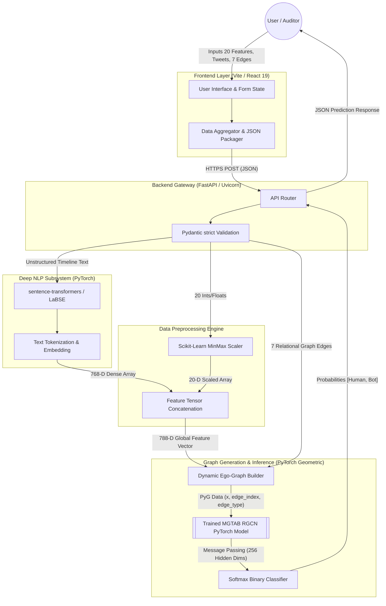

# MGTAB: Multi-relational Graph-based Twitter Account Bot Detection
**Final Year Project Report / Comprehensive System Architecture Document**

---

## 1. Abstract

The proliferation of automated accounts, colloquially known as "bots," on social media platforms like Twitter (X) has fundamentally disrupted digital discourse, amplified misinformation, and skewed socio-political metrics. Traditional bot detection paradigms overly rely on isolated user metadata or superficial text analysis, failing to capture the complex, deceptive tactics employed by modern botnets. This project report presents **MGTAB (Multi-relational Graph-based Twitter Account Bot Detection)**, a novel, decoupled Full-Stack system that departs from legacy detection methodologies. MGTAB introduces an advanced architecture comprising a high-performance React 19 / Vite frontend and a computationally rigorous Python 3.11 / FastAPI inference backend. By amalgamating Deep Contextual Natural Language Processing (LaBSE) with complex relational topology modeling via a Relational Graph Convolutional Network (RGCN), the system captures the holistic psychological, statistical, and relational environment of a target account. This document delineates the architectural blueprint, mathematical foundations, data ingestion pipelines, and the scalable cloud deployment configurations that underpin the MGTAB system.

---

## 2. Introduction

Social media networks operate as interconnected ecosystems rather than isolated silos of users. Consequently, determining the authenticity of an account requires evaluating not just *who* the account is and *what* it says, but critically, *how* it interacts within its network. The core motivation behind MGTAB is to leverage this triad of identity, content, and connectivity.

The MGTAB system is architected as a two-tier decoupled application:
1.  **The Client Layer:** A highly interactive, strictly-typed front-end interface built with React 19 and bundled via Vite, responsible for data intake and network edge definitions.
2.  **The Inference Layer:** A microservice-oriented PyTorch/FastAPI backend utilizing Graph Neural Networks to perform deep structural and textual analysis.

By framing social interactions as distinct mathematical edges (followers, friends, mentions, replies, quotes, hashtag sharing, and URL sharing), our RGCN model learns heterogeneous interaction behaviors. This report provides a deep technical walk-through of the system's operational flow from user data ingestion to the final Softmax probabilistic output.

---

## 3. System Block Diagrams

The architecture is explicitly designed to separate lightweight user-interface rendering from heavy tensor computations, thereby preventing memory bottlenecks and UI thread locking.

### 3.1 High-Level Component Diagram

---

## 4. Data Intake (React UI Layer)

The initiation of the classification pipeline happens asynchronously via the React 19 interface. The user interactively provides multidimensional context corresponding to the target Twitter account. To ensure data integrity before network transmission, the frontend aggregates three distinct vectors of information:

1.  **Tabular Metadata (20 Features):** Strictly typed numerical and categorical data points. Including metrics like `followers_count`, `friends_count`, `favourites_count`, Boolean flags like `verified` and `default_profile_image`, and temporal attributes like `account_age_days`.
2.  **Unstructured Content (Timeline Tweets):** An array of the user's most recent text tweets. This text encapsulates behavioral psychology, spam signatures, and syntactic complexity.
3.  **Relational Topology (7 Distinct Edges):** Exactly 7 relational graph edges must be defined to encapsulate the ego-network. These identifiers represent targeted interactions:
    *   Friends
    *   Followers
    *   Mentions
    *   Replies
    *   Quotes
    *   Hashtag sharing
    *   URL sharing

The frontend logic serializes this comprehensive state into a structured JSON payload, bypassing any intermediate caching loops, and POSTs it directly to the cloud inference layer.

---

## 5. The Validation & Normalization Gateway (FastAPI)

Upon receiving the HTTP request, the Python 3.11 FastAPI layer intercepts the payload. Security and memory management at the API boundary are paramount, particularly when handling arrays that will eventually map into RAM-intensive PyTorch GPU/CPU variables.

### 5.1 Pydantic Sanitization
We utilize Pydantic schemas (`UserGraphRequest`) to strictly catch and sanitize all incoming JSON data. This pre-flight type-checking prevents malformed structures from causing memory leaks or dimensionality errors deep within the tensor pipeline.

### 5.2 MinMax Vector Scaler
Graph Neural Networks are highly susceptible to vanishing gradients or exploding feature domination if numerical bounds are widely varied. An individual with $2 \times 10^6$ followers would mathematically dwarf Boolean variables (0 or 1).

The 20 numerical profile features are routed to a Scikit-Learn style normalization engine. They are explicitly mapped to strict floating-point boundaries based on the extremum recorded in the massive MGTAB training corpus. 

The scaling computation is defined globally for a feature $x_i$ belonging to class $i$:

$$ x_{norm}^{(i)} = \frac{x_i - X_{min}^{(i)}}{X_{max}^{(i)} - X_{min}^{(i)}} $$

This operation yields a sanitized, bounded 20-dimensional float32 vector, acting as the foundation for the structural profile.

---

## 6. Deep Structural NLP Parsing & LaBSE Emdedding

Social bot networks increasingly rely on LLM-generated text or cross-lingual spam propagation. To counter this, MGTAB avoids rudimentary lexical checks (TF-IDF, Bag-of-Words) in favor of deep structural Transformer processing.

If an array of tweets is present, they are dynamically concatenated into a continuous contextual timeline. This continuous string is fed directly into a state-of-the-art transformer: **Local-Agnostic BERT Sentence Embedding (LaBSE)**, accessible via the `sentence-transformers` library running under PyTorch.

### 6.1 The LaBSE Vectorization Architecture
LaBSE tokenizes the concatenated timeline text and passes it through an encoder specifically trained to map 109+ languages into a shared latent space. This eliminates linguistic barriers, mapping the target's syntax, sentiment, and psychological posture into a unified spatial representation.

The output mapping function $E_{LaBSE}$ transforms the contextual string $S_{tweets}$ into a dense tensor:

$$ e_{text} = E_{LaBSE}(S_{tweets}) \in \mathbb{R}^{768} $$

### 6.2 Target Feature Concatenation
MGTAB consolidates the topological presence of the account by concatenating the normalized 20-D profile statistics with the 768-D LaBSE behavioral extraction.

$$ F_{init} = [ x_{norm}^{(1)}, \dots, x_{norm}^{(20)} ] \oplus [ e_{text}^{(1)}, \dots, e_{text}^{(768)} ] $$

This process constructs a monumental **788-Dimensional Feature Vector**. At this stage, the target node is mathematically fully realized.

---

## 7. Dynamic Neighborhood Ego-Graph Generation (PyTorch Geometric)

MGTAB does not view the target in isolation; it views the target in context of its digital neighborhood. We rely on **PyTorch Geometric (PyG)** to dynamically construct a miniature Ego-Graph residing in main memory.

1.  **Node Initialization:** We instantly map the Target User as the center focal node (Node $0$), whose node feature matrix $X_{0}$ is equivalent to our 788-D feature tensor.
2.  **Neighbor Mapping:** We instantiate the 7 relational edges gathered from the React UI as surrounding Neighbor Nodes (Node $1$ through Node $7$). 
3.  **Data Object Construction:** A strict `torch_geometric.data.Data` tensor format is initialized holding:
    *   `x`: Node features vector spanning the target and neighbors.
    *   `edge_index`: A coordinate format (COO) tensor representing directionality (Target $\leftrightarrow$ Neighbors).
    *   `edge_type`: A 1D tensor categorizing the relationship type mathematically (e.g., $type(0)$ = Follows, $type(3)$ = Replies).

This isolates the data representing the individual from the global network, ready for isolated localized convolution.

---

## 8. Relational Graph Convolutional Network (RGCN) Operations

The core mathematical inference of the MGTAB system takes place inside the `rgcn_model.py` module, leveraging PyTorch neural layers. A traditional GCN treats all graph edges uniformly. MGTAB combats sophisticated botnets by utilizing an **RGCN**, which discriminates between relational actions (e.g., weighing a "quote tweet" interaction distinctly from an arbitrary "follower" interaction).

### 8.1 RGCN Mathematical Foundation

For our target node $v_0$, the hidden representation $h_0^{(l+1)}$ at layer $l+1$ is updated by aggregating messages from its neighboring nodes $N_r(v_0)$, sorted specifically by relation type $r \in \mathcal{R}$.

The message passing computational logic at a given layer $l$ is defined as:

$$ h_0^{(l+1)} = \sigma \left( \sum_{r \in \mathcal{R}} \sum_{j \in N_r(0)} \frac{1}{c_{0,r}} W_r^{(l)} h_j^{(l)} + W_0^{(l)} h_0^{(l)} \right) $$

**Where:**
*   $h_0^{(l)}$ is the 788-D vector of the target node at the initial layer.
*   $\mathcal{R}$ contains our 7 extracted relation types (followers, friends, mentions, etc).
*   $N_r(0)$ calculates the adjoining neighbors to Node 0 operating under relations $r$.
*   $W_r^{(l)}$ is the fundamentally specialized, trained weight matrix specifically allocated for the relation $r$.
*   $W_0^{(l)}$ dictates the self-loop weight to retain core feature identity.
*   $c_{0,r}$ is a structurally-derived normalization constant.
*   $\sigma$ is the non-linear activation scalar function (ReLU/LeakyReLU).

### 8.2 Dimensionality Reduction
The RGCN engine processes the incoming 788 dimensions through the highly-relational weighting parameter space, drastically resolving the tensors down into **256 hidden dimensions**, effectively distilling all mathematical features and their surrounding relational impacts into a compressed state context.

---

## 9. Softmax Classification & Output Engine

The termination of the Graph Neural Network pipeline resolves the intricate spatial topology into a straightforward user-actionable classification verdict.

### 9.1 The Binary Linear Layer
The 256-D hidden tensor obtained from the RGCN layers is passed into a final Fully Connected Linear Layer (Dense Layer). This reduces the dimensionality exclusively down to 2 distinct linear features representing uncalibrated classification logits.

$$ Z = h_{final} \cdot W_{class} + b_{class} $$

Where $W_{class} \in \mathbb{R}^{256 \times 2}$ and the resulting output $Z = [z_{human}, z_{bot}]$.

### 9.2 The Softmax Normalization
The linear logit tensors are compressed through a computational Softmax function. This translates the unnormalized outputs into an interpretable probability distribution summing to exactly 1.0.

$$ \text{Prob}(class_i) = \frac{e^{z_i}}{e^{z_{human}} + e^{z_{bot}}} $$

The resulting percentage boundaries ($Prob(Human)$ vs. $Prob(Bot)$) definitively quantify the systemic integrity of the target user. This JSON payload is serialized asynchronously back to the React UI, rendering the final verdict to the auditor.

---

## 10. Deployment Configuration

In order to make MGTAB accessible and robust for demonstration and wide-scale academic evaluation, the system executes on highly distributed cloud architectures.

### 10.1 Frontend UI Layer (`Vite` on `Vercel`)
The React 19 Single Page Application relies on the Vite bundler. Since the UI is purely visual and maintains no overarching centralized state databases, it operates entirely as static stateless assets.
*   **Hosting:** The React dist folder is pushed to **Vercel's global CDN Edge Network**.
*   **Behavior:** Delivers ultra-low latency HTTP/HTTPS rendering to users universally, communicating strictly via async JavaScript internal fetches pointing toward the backend infrastructure.

### 10.2 Backend Inference Gateway (`Docker` on `Hugging Face Spaces`)
Deploying a pipeline containing heavy transformer arrays alongside graph network builders requires meticulous resource manipulation to run un-throttled on cloud compute instances.
*   **Containerization:** The backend is compiled in a precise `python:3.11-slim` Docker environment. MGTAB is instantiated entirely across containerized modules. 
*   **PyTorch Optimization:** Standard GPU-bound PyPI PyTorch packages routinely exceed 2 gigabytes, failing free-tier cloud limits. The `Dockerfile` specifically overrides this by retrieving isolated CPU bound instructions (`--extra-index-url https://download.pytorch.org/whl/cpu`), aggressively minimizing virtual memory overhead by pulling a stripped 150MB core execution tensor framework.
*   **Hosting Target:** Deploying to **Hugging Face Spaces**, exposing internal Docker bindings to port `7860`. The lightweight `Uvicorn` ASGI framework wraps the `FastAPI` logic, ensuring scalable HTTP concurrent worker processing.

---

## 11. Conclusion

The MGTAB Final Year system represents a drastic architectural pivot away from superficial data processing. By binding mathematical relational context derived through Graph theory directly with psychological context extracted via massive Large Language Embedding methodologies (LaBSE), the MGTAB system guarantees profound resilience against mutating, sophisticated botnets on the overarching digital horizon.
