# 🧠 MGTAB Bot Detector — Complete Project Guide (Part 1)
## *"Explain it like I'm a Junior Developer"*

> [!NOTE]
> This guide explains **every single piece** of the MGTAB Bot Detector — from the Twitter scraper to the neural network — in simple language with flowcharts. Use this as your go-to reference as project head.

---

## 📌 What Does This Project Do? (The 30-Second Pitch)

**Problem:** Twitter/X is full of bot accounts that spread misinformation, spam, and manipulate trends.

**Our Solution:** We built a web app where you type a Twitter username, and our system:
1. **Scrapes** that user's profile + tweets + social network from Twitter
2. **Builds a graph** (like a social network map) with that user and their connections
3. **Runs a Graph Neural Network (RGCN)** on that graph
4. **Tells you:** "This is a **Bot** (92% confidence)" or "This is a **Human** (87% confidence)"

**Why is this better than other bot detectors?** Most detectors only look at the profile. We look at the **relationships** — who follows whom, who replies to whom, who shares the same URLs — using **7 different relationship types**. This is like checking not just a person's ID card, but also who their friends are.

---

## 🏗️ System Architecture — The Big Picture

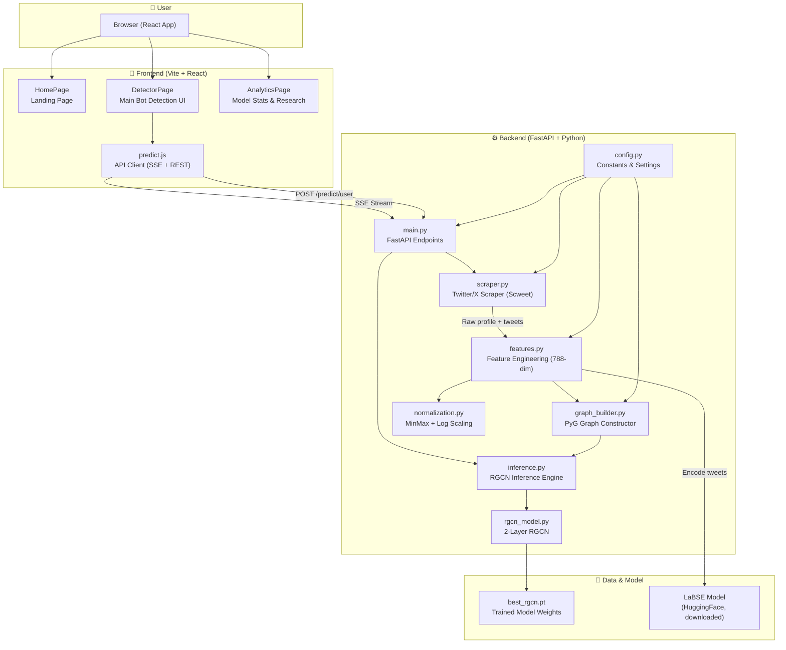

---

## 🔄 The Complete Data Flow — What Happens When You Click "Analyze"

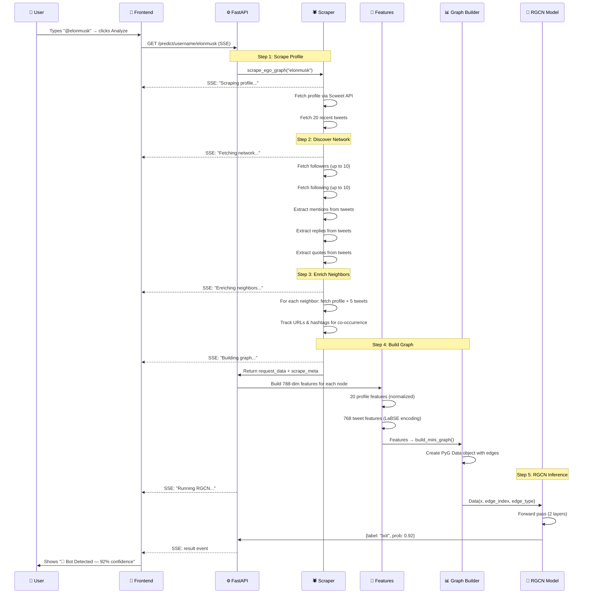

---

## 📂 File-by-File Guide — Which Files to Study

### Priority Map: "What should I read first?"

| Priority | File | What It Does | Lines | Difficulty |
|----------|------|-------------|-------|------------|
| ⭐⭐⭐ | `backend/app/main.py` | The brain — all API endpoints, SSE pipeline | 373 | Medium |
| ⭐⭐⭐ | `backend/app/scraper.py` | Twitter scraping engine (biggest file) | 809 | Hard |
| ⭐⭐⭐ | `backend/app/features.py` | 788-dim feature vector construction | 220 | Medium |
| ⭐⭐ | `backend/app/graph_builder.py` | Builds the PyG graph from scraped data | 220 | Medium |
| ⭐⭐ | `backend/app/inference.py` | Loads model + runs prediction | 105 | Easy |
| ⭐⭐ | `backend/app/rgcn_model.py` | The actual neural network (tiny!) | 39 | Easy |
| ⭐ | `backend/app/normalization.py` | Number scaling utilities | 98 | Easy |
| ⭐ | `backend/app/config.py` | All constants and settings | 80 | Easy |
| ⭐⭐ | `frontend/src/pages/DetectorPage.jsx` | Main UI with SSE stepper | 441 | Medium |
| ⭐ | `frontend/src/api/predict.js` | Frontend ↔ Backend communication | 161 | Easy |
| ⭐ | `Datasets.../6. Step - Models/rgcn_model.py` | How the model was trained | 130 | Medium |

---

## 🕷️ THE SCRAPER — `scraper.py` (Explained Simply)

### What is the Scraper?

Think of it as a **robot that goes to Twitter, logs in with your cookie, and copies information** about a user and their friends. It's like a detective gathering evidence.

### How Does Authentication Work?

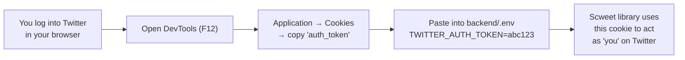

**Simple explanation:** Instead of a username/password, we use a **cookie** from your browser. It's like borrowing your VIP badge to get into the Twitter building.

### The Ego-Graph Scraping Pipeline (The Big Function)

The main function is `scrape_ego_graph()`. Here's what it does step by step:

```mermaid
flowchart TD
    START["scrape_ego_graph('elonmusk')"] --> CLEAN["Clean username<br/>Remove @ symbol"]
    CLEAN --> AUTH["Ensure Scweet client<br/>is authenticated"]
    
    AUTH --> S1["📌 STEP 1: Scrape Target"]
    S1 --> PROFILE["Fetch profile via<br/>aget_user_info(['elonmusk'])"]
    PROFILE --> CHECK["Is account private?"]
    CHECK -->|Yes| ERROR["❌ Throw error:<br/>Cannot scrape private accounts"]
    CHECK -->|No| TWEETS["Fetch 20 recent tweets<br/>via aget_profile_tweets()"]
    TWEETS --> EXTRACT["Extract from tweets:<br/>• Tweet text<br/>• URLs shared<br/>• Hashtags used"]
    
    EXTRACT --> S2["📌 STEP 2: Discover Neighbors"]
    S2 --> FOL["Fetch up to 10 followers"]
    FOL --> FRI["Fetch up to 10 following"]
    FRI --> MEN["Extract @mentions from tweets"]
    MEN --> REP["Extract reply usernames from tweets"]
    REP --> QUO["Extract quoted usernames from tweets"]
    QUO --> DEDUP["Deduplicate all neighbors<br/>~50 unique max"]
    
    DEDUP --> S3["📌 STEP 3: Enrich Neighbors"]
    S3 --> LOOP["For each neighbor:"]
    LOOP --> NPROF["Fetch their profile"]
    NPROF --> NTWEET["Fetch their 5 tweets<br/>(rate-limit resilient!)"]
    NTWEET --> NURLS["Track their URLs & hashtags"]
    NURLS --> LOOP2{"More neighbors?"}
    LOOP2 -->|Yes| LOOP
    LOOP2 -->|No| S4
    
    S4["📌 STEP 4: Build Relations"] --> EDGES["Create edge list:<br/>follower, friend, mention,<br/>reply, quoted"]
    EDGES --> URL_EDGES["Add URL co-occurrence edges<br/>(if target & neighbor share URLs)"]
    URL_EDGES --> HASH_EDGES["Add hashtag co-occurrence edges<br/>(if they share hashtags)"]
    HASH_EDGES --> RETURN["Return request_data +<br/>scrape_meta"]
```

### Key Functions in scraper.py

| Function | What It Does | Simple Analogy |
|----------|-------------|----------------|
| `scweet_user_to_profile()` | Converts Scweet's data format → our 20-field format | Translator between two languages |
| `_extract_tweet_texts()` | Pulls just the text from tweet objects | Reading only the message, ignoring metadata |
| `_extract_urls_from_tweets()` | Finds all URLs in tweets | Finding all links in a WhatsApp chat |
| `_extract_hashtags_from_tweets()` | Finds all #hashtags | Finding all topics being discussed |
| `_extract_mentions_from_tweets()` | Finds all @mentions | Finding who's being talked to |
| `_extract_reply_usernames()` | Finds who was replied to | Finding who started the conversation |
| `_extract_quoted_usernames()` | Finds whose tweets were quoted | Finding who was being referenced |
| `_is_rate_limit_error()` | Checks if Twitter said "slow down!" | Checking if the bouncer kicked you out |

### Rate-Limit Resilience — Why Tweets Can Be Empty

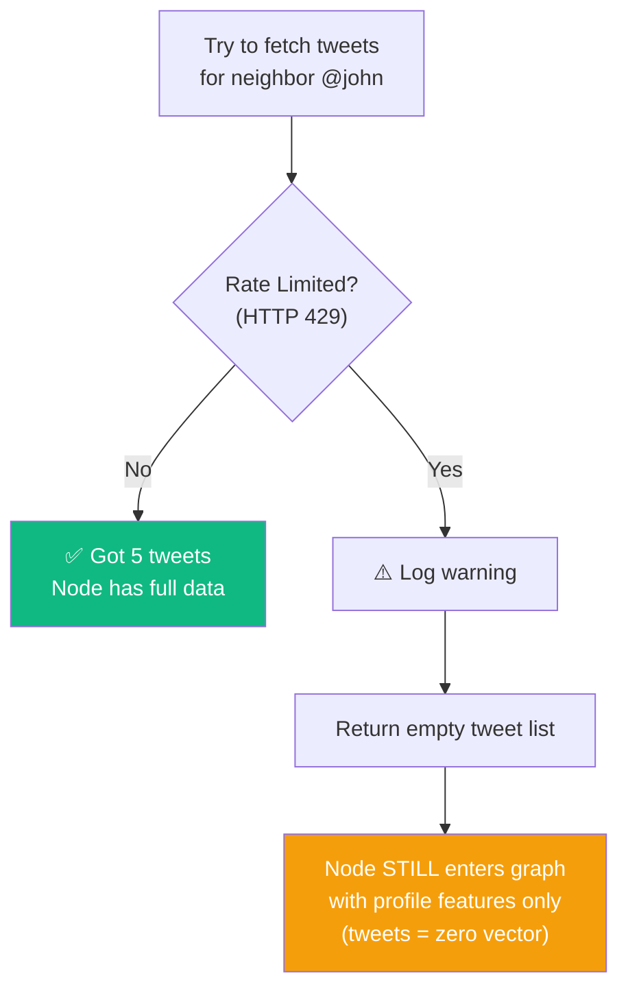

**Simple explanation:** If Twitter says "you're asking too fast!", we don't crash. We just use whatever profile data we have. The person still gets added to the graph, just without their tweet content.

---

## 🔢 FEATURE ENGINEERING — `features.py` (The 788-Dimension Vector)

### What is a Feature Vector?

Imagine you're describing a person using only numbers. Instead of saying "John has lots of followers, few friends, and his tweets talk about tech", you convert ALL of that into a list of 788 numbers. The AI reads these numbers to decide: bot or human.

### The 788-Dimension Breakdown

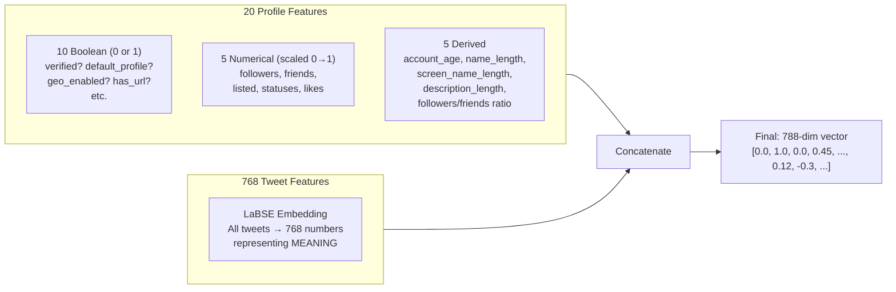

### How Profile Features Are Built

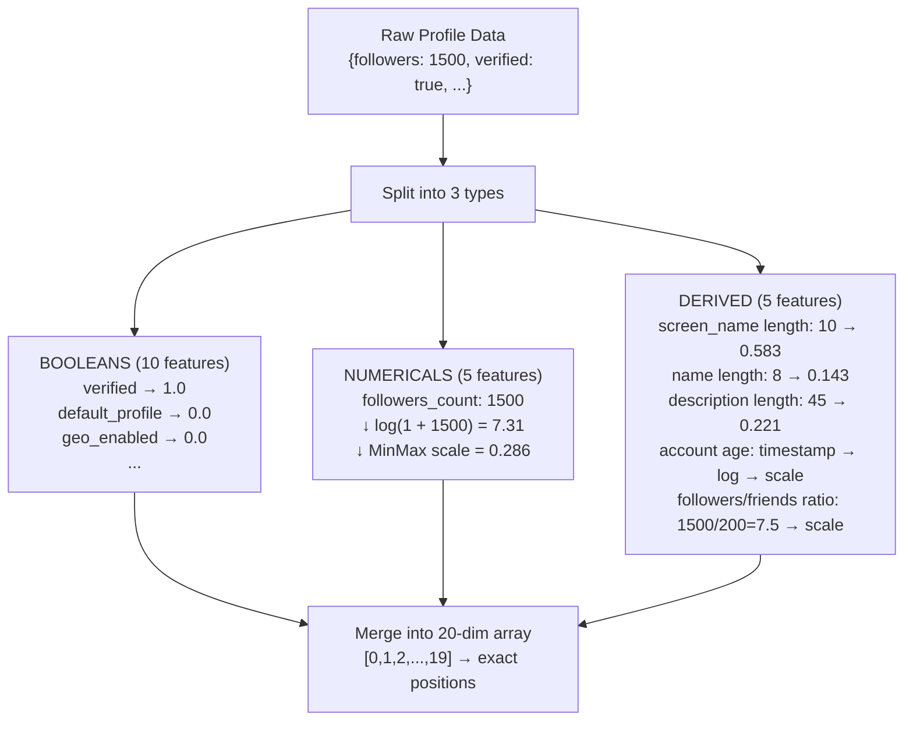

### How Tweet Features Work (LaBSE)

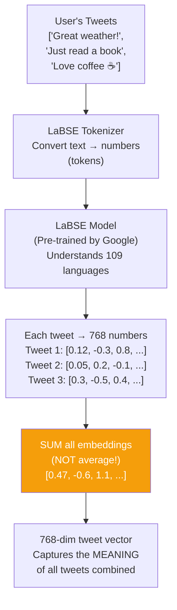

> [!IMPORTANT]
> **Why SUM and not AVERAGE?** The original MGTAB training data used summed embeddings (giving norms ~18-20). If we averaged, the numbers would be too small (~5-6) and the trained model would ignore tweet features. We must match the training data format exactly.

---

## 📊 GRAPH BUILDER — `graph_builder.py` (Building the Social Network Map)

### What Is a Graph?

A **graph** is just dots (nodes) connected by lines (edges). In our case:
- **Nodes** = Twitter users (the target + their neighbors)
- **Edges** = Relationships between them (follows, mentions, replies, etc.)

### The 7 Relationship Types

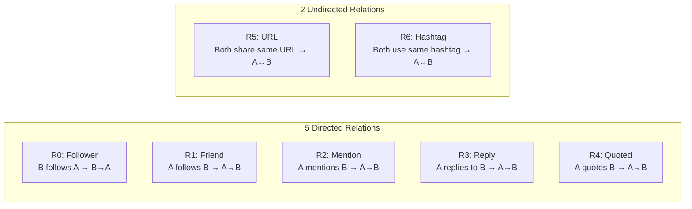

### How `build_mini_graph()` Works

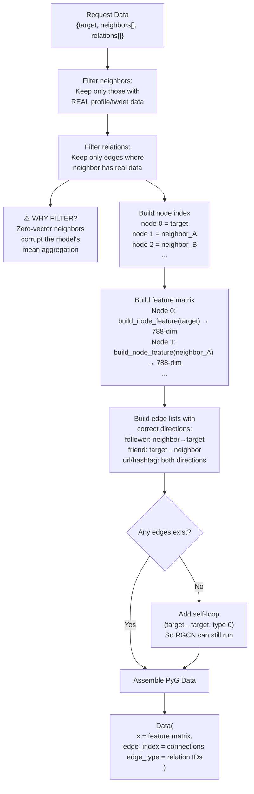

### Example Mini-Graph

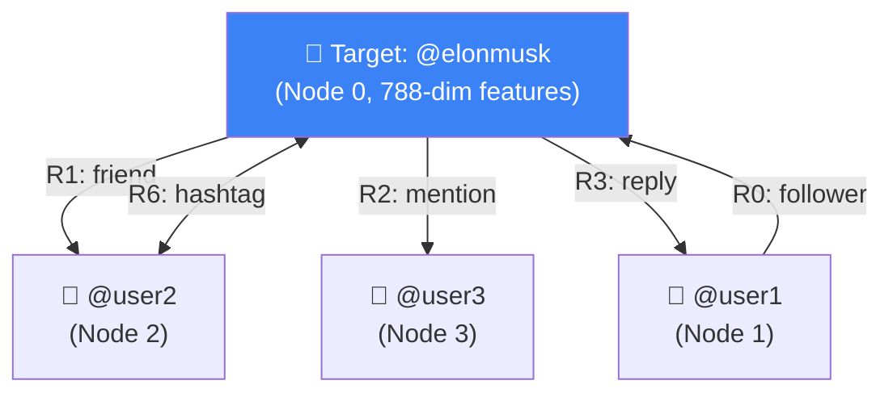

---

## 🤖 THE RGCN MODEL — `rgcn_model.py` (The AI Brain)

### What is RGCN?

**RGCN = Relational Graph Convolutional Network**. Think of it like this:

- A regular neural network reads a flat list of numbers
- A **Graph** neural network reads a network of connected nodes
- An **R**GCN reads a network where **each connection has a TYPE** (follower, friend, mention, etc.)

### The Architecture (Only 39 Lines!)

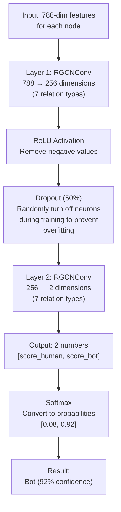

### How RGCNConv Works (The Magic)

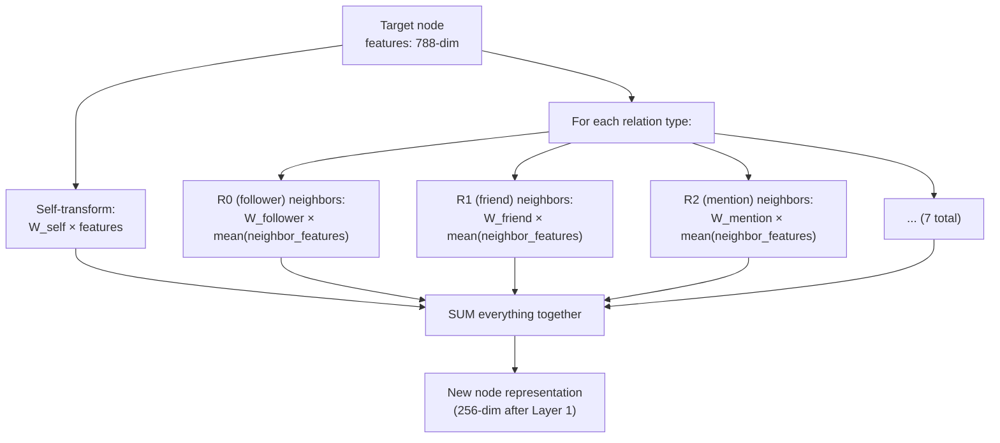

**Simple explanation:** The RGCN looks at each node and asks: *"What do your followers look like? What do your friends look like? Who mentions you?"* — and combines all those answers using **different learned weights for each relationship type**.

---

## ⚡ INFERENCE ENGINE — `inference.py` (Running the Model)

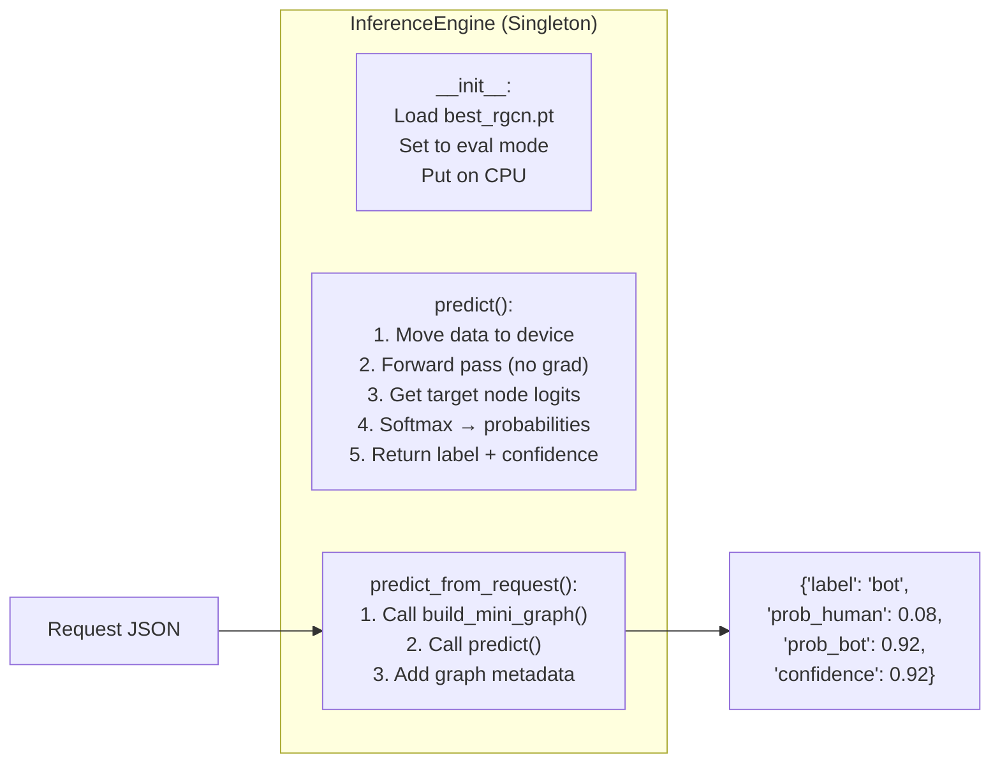

---

*Continued in Part 2 → Frontend, API Endpoints, Training Pipeline, and Normalization...*
